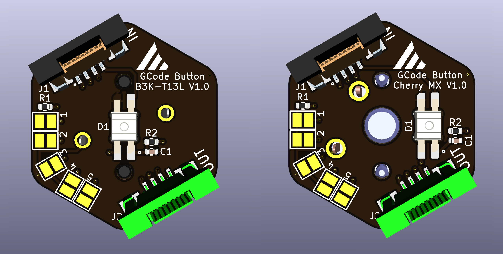
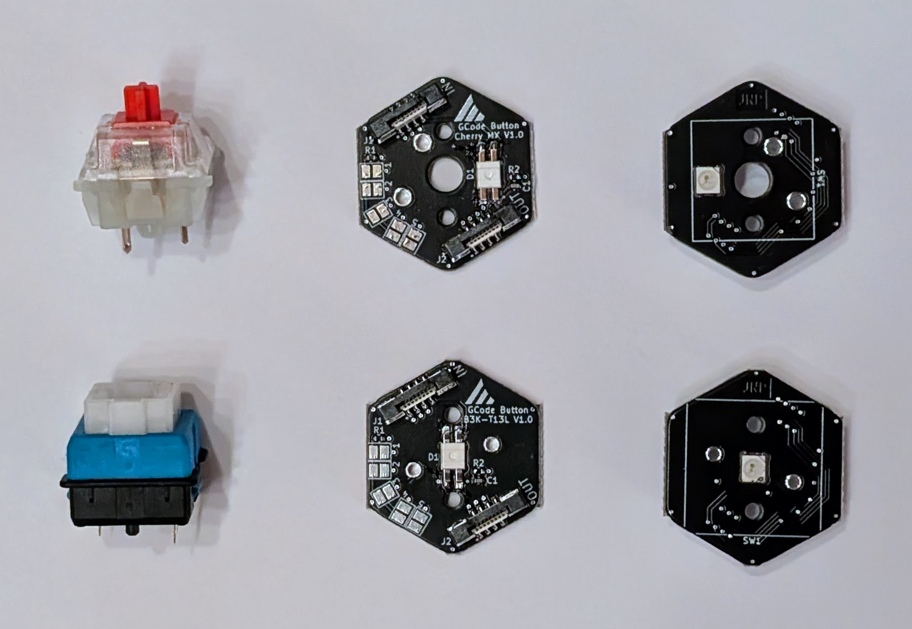
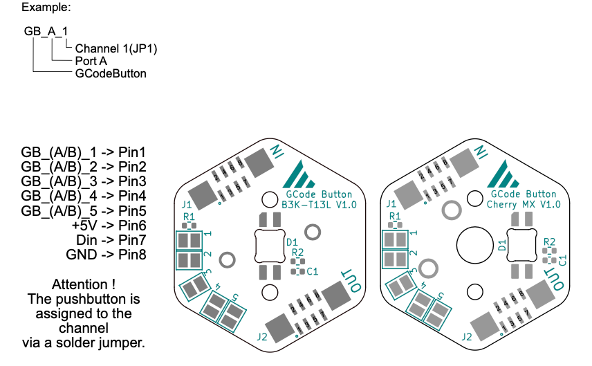

# Button Boards

The Button Boards are specially developed PCBs that enable intuitive and visually appealing control for Klipper-based 3D
printers. These small PCBs have two versions: one for **Cherry-MX** buttons and one for **Romer-G (B3K-T1RL)** buttons.
Both versions offer a high-quality, precise switching mechanism specially developed for demanding applications.

Each button board is equipped with a NeoPixel, which illuminates the button from behind and serves as a status
indicator. This LED can be individually programmed to visualize the system's current status or specific functions.
This integrated lighting provides an aesthetic enhancement and clear visual feedback directly on the push-button.

Solder pads are placed on the PCBs to set the order of the buttons in the daisy chain. The button boards are connected
via FFC/FPC flat cables with 8 pins and a 0.5 mm pitch, which ensures simple and tidy cabling.

The Button Boards, therefore, offer an excellent combination of functionality, flexibility, and design, making them the
ideal addition to any Klipper-based control system. Whether you prefer Cherry-MX or Romer-G buttons, both versions
deliver precise and reliable performance, further enhanced by the integrated status lighting.

## Features
- 2 versions: Cherry-MX and Romer-G (B3K-T1RL)
- integrated NeoPixel LED for status indication
- daisy chain connection via FFC/FPC flat cables (8-pin, 0.5 mm pitch)
- solder pads for setting the button order

## Pinout

## Downloads
- [Cherry-MX Button Board Schematic](https://github.com/meteyou/klipper-gcode-buttons/blob/main/hardware/GCode_Buttons_Cherry_MX/Schematic/GCode_Buttons_Cherry_MX.pdf){:target="_blank"}
- [Cherry-MX Button Board KiCad Project](https://github.com/meteyou/klipper-gcode-buttons/blob/main/hardware/GCode_Buttons_Cherry_MX/){:target="_blank"}
- [Cherry-MX Button Board CAD Model](https://github.com/meteyou/klipper-gcode-buttons/blob/main/hardware/GCode_Buttons_Cherry_MX/CAD/GCode_Buttons_Cherry_MX_PCB.step){:target="_blank"}
- [Romer-G Button Board Schematic](https://github.com/meteyou/klipper-gcode-buttons/blob/main/hardware/GCode_Buttons_B3K-T13L/Schematic/GCode_Buttons_B3K-T13L.pdf){:target="_blank"}
- [Romer-G Button Board KiCad Project](https://github.com/meteyou/klipper-gcode-buttons/tree/main/hardware/GCode_Buttons_B3K-T13L){:target="_blank"}
- [Romer-G Button Board CAD Model](https://github.com/meteyou/klipper-gcode-buttons/blob/main/hardware/GCode_Buttons_B3K-T13L/CAD/GCode_Buttons_B3K-T13L_PCB.step){:target="_blank"}
