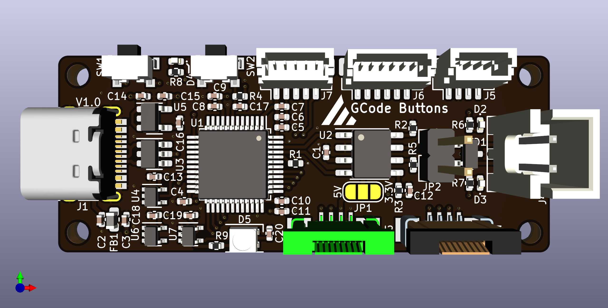
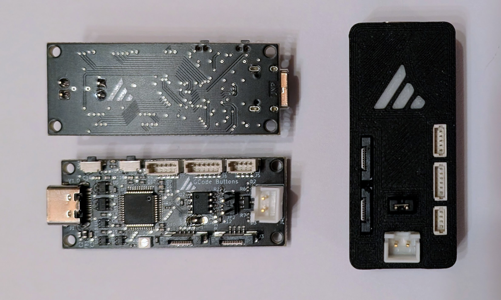
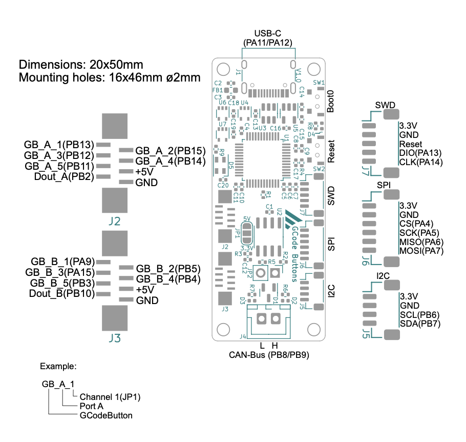

# Communication Board

The main communication board is a compact, versatile solution designed to optimize control and communication in 
Klipper-based systems. This small board can be connected to the Klipper host (SBC) via USB or CAN. The board can also be
used as a USB-to-CAN bridge with a USB connection, making it an ideal choice for integrating CAN toolhead boards into
Klipper.

The board allows the connection of up to 10 hardware buttons connected via flexible FFC/FPC flat cables (8-pin, 0.5 mm
pitch). The buttons are organized in two daisy chains, each supporting up to 5 buttons. This architecture ensures simple
and clean cabling that is also flexible and expandable.

At the heart of the board is a powerful STM32F072 MCU with native hardware support for CAN. This ensures reliable and
fast communication, especially in advanced Klipper 3D printers.

Therefore, this main communication board is a central component for advanced control and communication tasks in modern
Klipper systems and offers a wide range of applications thanks to its compact design and powerful features.

## Features
- 2x 5 buttons with NeoPixel LEDs (daisy chain via FFC/FPC flat cables 8-pin, 0.5 mm pitch)
- STM32F072 MCU
- SWD programming interface
- I2C and SPI interfaces
- USB interface with ESD protection
- CAN interface with ESD protection
- Katapult (Bootloader) support with status LED
- Reset button on the board
- BOOT0 button on the board (DFU mode)
- Supports 3.3V/4V CAN transceivers
- Onboard NeoPixel LED for status indication
- Level shifter for NeoPixel LEDs
- 5V power supply via USB

## Possible communications
- USB → CAN (USB-to-CAN Bridge)
- USB → SPI
- USB → I2C
- USB → Gcode-Buttons
- CAN → Gcode-Buttons
- CAN → SPI
- CAN → I2C

## Pinout

## Downloads
- [Schematic](https://github.com/meteyou/klipper-gcode-buttons/blob/main/hardware/GCode_Buttons_MCU/Schematic/Schematic_GCode_Buttons_MCU.pdf){:target="_blank"}
- [KiCad Project](https://github.com/meteyou/klipper-gcode-buttons/tree/main/hardware/GCode_Buttons_MCU){:target="_blank"}
- [CAD Model](https://github.com/meteyou/klipper-gcode-buttons/blob/main/hardware/GCode_Buttons_MCU/CAD/GCode_Buttons_MCU_PCB.step){:target="_blank"}
- [Pinout](https://github.com/meteyou/klipper-gcode-buttons/blob/main/hardware/Documentation/GCode_Buttons_PCBs.pdf){:target="_blank"}
- [MCU Case STLs](https://github.com/meteyou/klipper-gcode-buttons/tree/main/STLs/MCU_Case){:target="_blank"}
- [MCU Case Fusion 360](https://github.com/meteyou/klipper-gcode-buttons/blob/main/CAD/GCode_Buttons_MCU_Case.f3d){:target="_blank"}
- [MCU Case STEP](https://github.com/meteyou/klipper-gcode-buttons/blob/main/CAD/GCode_Buttons_MCU_Case.step){:target="_blank"}
